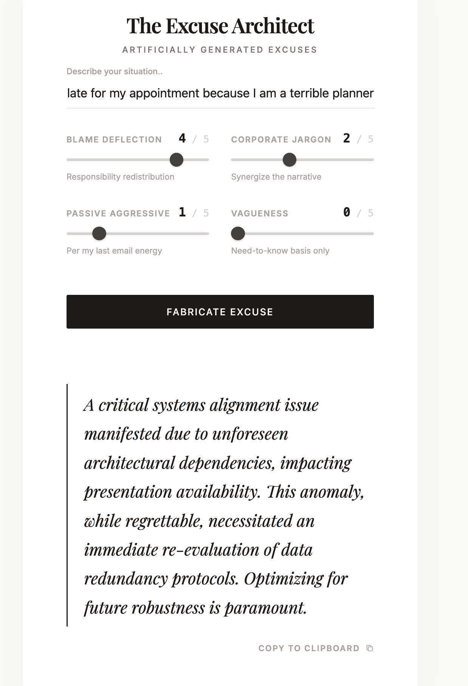

Work in progress project.

Excuse Architect is a full-stack app that generates excuses based on an input scenario and sliders that determine the type of response you want to get.
This is a work in progress project, mostly for practice.

Features:
- Flask backend with Pydantic validation
- HTML/CSS/JS Frontend
- Uses the Gemini API.

To add/refactor:
- Ranking of resposes, view them
- proper db to be added
- more..

Requires an .env file with following env variables:
FLASK_ENV=dev
DEBUG=true
PORT=5000
GEMINI_API_KEY=yourgeminiapikey
USE_MOCK_API=false
